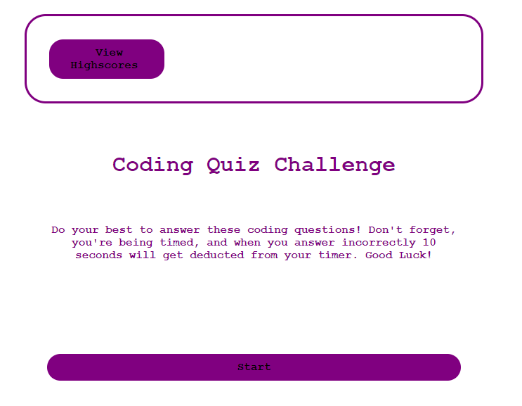

<h1>Coding Quiz</h1>
<h2>Mariah Eckrich</h2>

Description: This is a Javascript Code Quiz assignment for Module 4. I made this mostly using Javascript while dipping my toes into web API's.

User Story:
AS A coding boot camp student
I WANT to take a timed quiz on JavaScript fundamentals that stores high scores
SO THAT I can gauge my progress compared to my peers

Acceptance criteria:
GIVEN I am taking a code quiz
WHEN I click the start button
THEN a timer starts and I am presented with a question
WHEN I answer a question
THEN I am presented with another question
WHEN I answer a question incorrectly
THEN time is subtracted from the clock
WHEN all questions are answered or the timer reaches 0
THEN the game is over
WHEN the game is over
THEN I can save my initials and score

<h2>Screenshot</h2>
 

<h2>Link to deployed application</h2>

 https://meck512.github.io/code-quiz/

